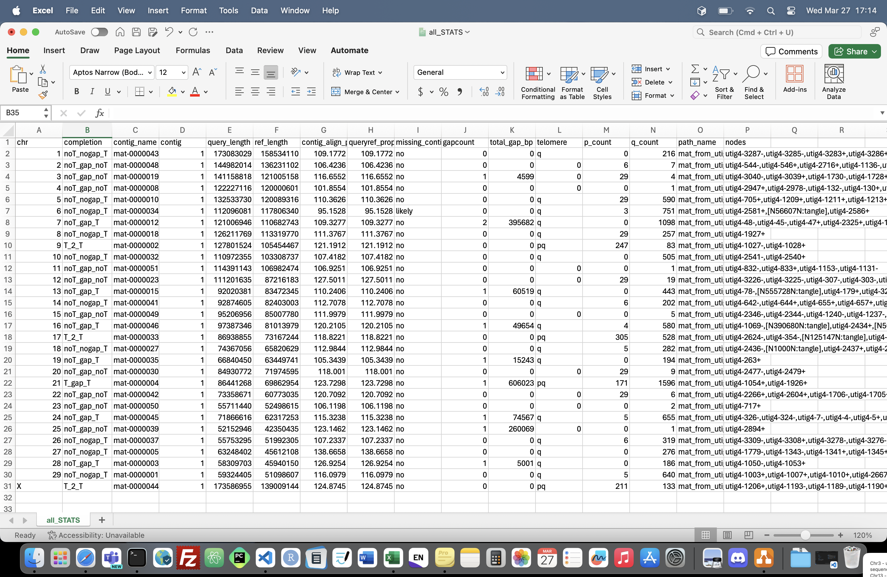

# assembly_initialqc

Script for checking homologous chromosomes with a reference genome and checking gap and telomeric sequence presence after contig assembly.

## Requirements

- [R](https://www.r-project.org)
- [samtools](http://www.htslib.org)
- [minimap2](https://github.com/lh3/minimap2)
- [tidk](https://github.com/tolkit/telomeric-identifier)
- [seqtk](https://github.com/lh3/seqtk)
- [Java](https://www.java.com/en/)

## Installation

1. Clone the repository:

        git clone https://github.com/plnspineda/assembly_initialqc.git
        cd assembly_initialqc
        chmod +x assembly_initialqc.sh

2. Create a conda environment (Optional if you already have the tools specified in requirements):

        conda env create --file initialqc-env.yml
        conda activate initialqc

3. Run

        export QC="$PWD"
        $QC/assembly_initialqc.sh

## Usage

    $QC/assembly_initialqc.sh -r <ref.fa> -q <qry.fa> -o <dir_out> -map [assembly.scfmap] -path [assembly.paths.tsv] -threads 4

        -r reference genome"
        -q query genome"
        -o output directory"
        -map assembly.scfmap output from verkko (optional)"
        -path assembly.paths.tsv output from verkko (optional)"
        -tel_cutoff telomere count cutoff (default 50)"
        -t threads (default 2)"

wherein:

- `ref.fa` is the reference fasta genome
- `asm.fa` is the draft contig assembly
- `outdir` is the output directory (will make one if the folder do not exists)
- `assembly.scfmap` is an output from verkko along with `assembly.paths`. These are used to get the pathname and nodes for each chromosome/contig.
- `4` is the number of threads

## To run in local

This is for haplotype 1

        #!/bin/bash
        conda activate initialqc
        export QC="path/to/assembly_initialqc"

        ref="path/to/ref.fa"
        qry=assembly.haplotype1.fasta
        out=hap1

        $QC/assembly_initialqc.sh $ref.fa $qry $out assembly.scfmap assembly.paths.tsv

## To run in phoenix server

Install `tidk`, edit the input files and run the following modules:

        #!/bin/bash
        #SBATCH -p a100cpu
        #SBATCH -N 1
        #SBATCH -n 24
        #SBATCH --time=02:00:00
        #SBATCH --mem=48GB

        module purge
        module use /apps/modules/all
        module load R
        module load SAMtools/1.17-GCC-11.2.0
        module load minimap2/2.26-GCCcore-11.2.0
        module load Java/17.0.6
        module load seqtk/1.3-GCC-11.2.0

        export QC="path/to/assembly_initialqc"

        ref="/path/to/ref.fa"
        qry=assembly.haplotype1.fasta
        out=hap1

        $QC/assembly_initialqc.sh $ref.fa $qry $out assembly.scfmap assembly.paths.tsv

## Expected output files

The final output information that will tell status of chromosomes can be found in `all_STATS.tsv` (eg. if T2T, TgapT, etc.)

The `all_STATS.tsv` will look like this:

Description of columns:

- `chr` - chromosome
- `completion` - status of the chromosome (T means with telomere, noT means no telomere). There are 8 scenarios where you can either have T (with telomere) or noT (no telomere) at p-arm, with gap or no gap, and T or noT at q-arm. `T2T` indicates complete chromosome (telomere-to-telomere). For example, `noT_gap_T` means there is no telomere at p-arm, there is gap within the sequence and there is telomere at q-arm.
- `score` - *to be implemented*
- `contig_name` - the contig comprising of that chromosome
- `contig` - number of contig aligning to that chromosome
- `query_length` - total contig size (bp)
- `ref_length` - reference size (bp)
- `contig_align` - percentage of the query vs the reference (query_length/ref_length*100)
- `queryref_proportion` - percentage of the contigs with the reference
- `missing_contig` - will indicate `likely` if the `contig_align` is less than 100%
- `gapcount` - number of gaps within the contigs
- `total_gap_bp` - size of gaps in total (bp)
- `telomere` - will indicate `p` if there's telomere in chromosome's short-arm, `q` if it's in chromosome's long-arm, `pq` if it's in both, or `0` if there is none. We counted presence of telomere if there is 50 counts of `TTAGGG/CCCTAA` within the 20Kbp window at each end of the sequence.
- `p_count` - number of telomeric sequence (TTAGGG) in p-arm
- `q-count` - number of telomeric sequence (TTAGGG) in q-arm
- `path_name` - the name of the contig pathway (this is useful for bandage visualisation)
- `nodes` - the nodes sequence for that contig (this is useful for bandage visualisation. copy this sequence and paste it in `find node` in bandage to see this contig in the graph)

file:

    - all_chr_assembly.tsv (incomplete information about each homologous contigs, can be deleted)
    - all_STATS.tsv (final output table with all information)
    - *_tmp_asm_bedgraph_tidk-search_telomeric_repeat_windows.bedgraph (bedgraph of the telomeres for autosomes)
    - *.coor (gaps coordinate)
    - *_tmp_asm.fasta (autosomal fasta file)
    - *.svg (telomeric signal plot)
    - *search_telomeric_repeat_windows.tsv (telomeric signal per 10kb window)
    - minimap.paf (alignment file)

folders:

    - archived (contains detailed information of the alignment per chromosomes)
    - contig_list (contains lists of contigs, orientation and proportion with the reference genome)
    - combine (contains fasta file of each chromosomes)

This script also uses [CombineFasta](https://github.com/njdbickhart/CombineFasta) to reorient the contigs in the same orientation as the reference genome.

...still under development...
