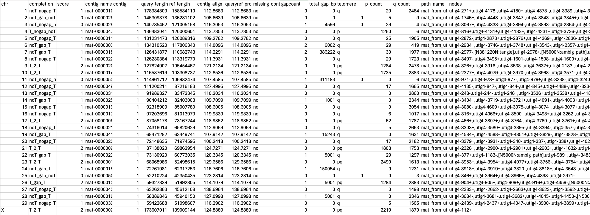

# assembly_initialqc

Script for checking homologous chromosomes with a reference genome and checking gap and telomeric sequence presence after contig assembly.

## Requirements

- [R](https://www.r-project.org)
- [samtools](http://www.htslib.org)
- [minimap2](https://github.com/lh3/minimap2)
- [tidk](https://github.com/tolkit/telomeric-identifier)
- [seqtk](https://github.com/lh3/seqtk)
- [Java](https://www.java.com/en/)
- [bedtools](https://github.com/arq5x/bedtools2)

## Installation

1. Clone the repository:

        git clone https://github.com/plnspineda/assembly_initialqc.git
        cd assembly_initialqc
        chmod +x assembly_initialqc.sh

2. Create a conda environment (Optional if you already have the tools specified in requirements):

        conda env create --file initialqc-env.yml
        conda activate initialqc

3. Run

        export QC="$PWD"
        $QC/assembly_initialqc.sh

## Usage

    $QC/assembly_initialqc.sh -r <ref.fa> -q <asm.fa> -o <dir_out> -m [assembly.scfmap] -p [assembly.paths.tsv] -t 4

        -r      reference genome
        -q      query genome
        -o      output directory
        -m      assembly.scfmap output from verkko (optional)
        -p      assembly.paths.tsv output from verkko (optional)
        -c      telomere count cutoff (count of "TTAGGG"). (default 50) ie. if telomere count is less than 50, then it will not accept the telomere presence of that chromosome.
        -t      threads (default 2)

wherein:

- `ref.fa` is the reference fasta genome
- `asm.fa` is the draft contig assembly
- `outdir` is the output directory (will make one if the folder do not exists)
- `assembly.scfmap` is an output from verkko along with `assembly.paths`. These are used to get the pathname and nodes for each chromosome/contig.

## To run in local

This is for haplotype 1

        #!/bin/bash
        conda activate initialqc
        export QC="path/to/assembly_initialqc"

        ref="path/to/ref.fa"
        qry="assembly.haplotype1.fasta"
        dir="hap1"
        map="assembly.scfmap"
        path="assembly.paths.tsv"

        "$QC"/assembly_initialqc.sh -r "$ref" -q "$qry" -o "$dir" -m "$map" -p "$path" -t "32"

## To run in phoenix server

Install `tidk`, edit the input files and run the following modules:

        #!/bin/bash
        #SBATCH -p a100cpu
        #SBATCH -N 1
        #SBATCH -n 32
        #SBATCH --time=02:00:00
        #SBATCH --mem=64GB

        module purge
        module use /apps/modules/all
        module load R
        module load SAMtools/1.17-GCC-11.2.0
        module load minimap2/2.26-GCCcore-11.2.0
        module load Java/17.0.6
        module load seqtk/1.3-GCC-11.2.0
        #conda activate centromere

        export QC="/hpcfs/users/a1812753/Tuli_x_Wagyu/scripts/assembly_initialqc"

        ref="/hpcfs/users/a1812753/reference_assemblies/ARS-UCD2.0_frozen.fna"
        qry="assembly.haplotype1.fasta"
        dir="hap1"
        map="assembly.scfmap"
        path="assembly.paths.tsv"

        "$QC"/assembly_initialqc.sh -r "$ref" -q "$qry" -o "$dir" -m "$map" -p "$path" -t "32"

## Expected output files

The final output information that will tell status of chromosomes can be found in `all_STATS.tsv` (eg. if T2T, TgapT, etc.)

The `all_STATS.tsv` will look like this:

Description of columns:

- `chr` - chromosome
- `completion` - status of the chromosome (T means with telomere, noT means no telomere). There are 8 scenarios where you can either have T (with telomere) or noT (no telomere) at p-arm, with gap or no gap, and T or noT at q-arm. `T2T` indicates complete chromosome (telomere-to-telomere). For example, `noT_gap_T` means there is no telomere at p-arm, there is gap within the sequence and there is telomere at q-arm.
- `score` - 2 if `T2T`, 1 if it has only 1 telomere
- `contig_name` - the contig comprising of that chromosome
- `contig` - number of contig aligning to that chromosome
- `query_length` - total contig size (bp)
- `ref_length` - reference size (bp)
- `contig_align` - percentage of the query vs the reference (query_length/ref_length*100)
- `queryref_proportion` - percentage of the contigs with the reference
- `missing_contig` - will indicate `likely` if the `contig_align` is less than 100%
- `gapcount` - number of gaps within the contigs
- `total_gap_bp` - size of gaps in total (bp)
- `telomere` - will indicate `p` if there's telomere in chromosome's short-arm, `q` if it's in chromosome's long-arm, `pq` if it's in both, or `0` if there is none. We consider presence of telomere if base on VGP-pipeline standard. Basically, 50% of the 1000bp window has the "TTAGGG" or "CCCTAA"
- `p_count` - number of telomeric sequence (TTAGGG) in p-arm
- `q-count` - number of telomeric sequence (TTAGGG) in q-arm
- `p_len` - length of the telomere in p-arm
- `q_len` - length of the telomere in the q-arm
- `p_start` - start of the telomere in the p-arm
- `p-end` - end of the telomere in the p-arm
- `q_start` - start of the telomere in the q-arm
- `q-end` - end of the telomere in the q-arm
- `path_name` - the name of the contig pathway (this is useful for bandage visualisation)
- `nodes` - the nodes sequence for that contig (this is useful for bandage visualisation. copy this sequence and paste it in `find node` in bandage to see this contig in the graph)

file:

    - all_chr_assembly.tsv (incomplete information about each homologous contigs, can be deleted)
    - all_STATS.tsv (final output table with all information)
    - *_tmp_asm_bedgraph_tidk-search_telomeric_repeat_windows.bedgraph (bedgraph of the telomeres for autosomes)
    - *.coor (gaps coordinate)
    - *_tmp_asm.fasta (autosomal fasta file)
    - *.svg (telomeric signal plot)
    - *search_telomeric_repeat_windows.tsv (telomeric signal per 10kb window)
    - minimap.paf (alignment file)

folders:

    - archived (contains detailed information of the alignment per chromosomes)
    - contig_list (contains lists of contigs, orientation and proportion with the reference genome)
    - combine (contains fasta file of each chromosomes)

This script also uses [CombineFasta](https://github.com/njdbickhart/CombineFasta) to reorient the contigs in the same orientation as the reference genome. \
This script also uses [VGP-pipeline]([https://github.com/njdbickhart/CombineFasta](https://github.com/VGP/vgp-assembly)) to get the telomere lengths.

# Revisions

### Version 2.2 (July 18, 2024)
changes:
- changed the telomere analysis to include telomere_analysis.sh from [vgp-pipeline](https://github.com/VGP/vgp-assembly). Basically, in 1k window, will look for occurence of "TTAGGG" and if the window contains 50% of this repeat, then it will count as telomere length. (on-going)
- because of this, additional column in the *stat.txt for telomere length.
- T2T chromosome standard will also change based on the telomere_analysis.sh result

### Version 2.1 (March 27, 2024)

changes:
- made map and path file optional so could run with hifiasm assembly as well
- trying to add parameters... still commented as not yet tested
